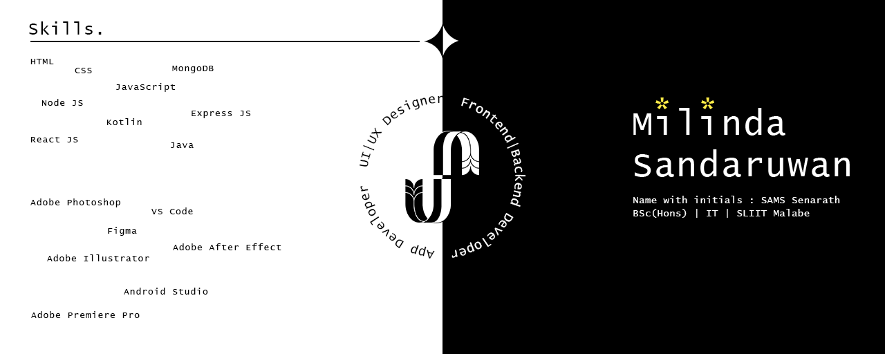

  

<h2 align="center">Hello, I'm Milinda Sandaruwan</h2>

## About Me

I'm an undergraduate at SLIIT University passionate about full-stack development and software engineering. I specialize in building scalable web applications using modern technologies like JavaScript, React, Node.js, and database systems. I enjoy solving complex problems, contributing to open-source projects, and continuously learning new technologies to create impactful solutions.

## Skills and Technologies

**Programming Languages:** JavaScript, Java, Python, C, C++, PHP, SQL, Kotlin  
**Frontend Development:** HTML5, CSS3, React, Angular  
**Backend Development:** Node.js, REST APIs, Java EE, JSP, Servlets  
**Mobile Development:** Android Studio, Kotlin  
**Databases:** MongoDB, MySQL  
**Tools & Platforms:** Git, Linux, VS Code, IntelliJ IDEA, Figma, Apache Tomcat, Eclipse IDE  
**Design & Media:** Photoshop, Illustrator, After Effects, Premiere Pro

## Main Repositories

| Repository | Description | Technologies |
|------------|-------------|--------------|
| [AutoFiks-ITP-Project](https://github.com/milindasandaru/AutoFiks-ITP-Project) | Comprehensive automotive management system with customer service, employee management, and spare parts modules | Node.js, React, MongoDB, Express |
| [WALLET - Personal Finance Tracker](https://github.com/milindasandaru/Wallet_The_Financial_Tracker) | Personal finance management mobile application with real-time transactions, smart data storage, and powerful analytics for better financial decisions | Kotlin, Android Studio |
| [Online Banking System](https://github.com/milindasandaru/HDSCOnlineBankingSystem) | Java EE web application for online banking with user authentication, bill payment, transaction history, and password recovery via email/OTP | Java EE, JSP, Servlets, MySQL, Apache Tomcat |

## GitHub Statistics

<table>
<tr>
<td></td>
<td></td>
</tr>
<tr>
<td></td>
<td></td>
</tr>
</table>

## Connect With Me

  
  
  
  
  

---

  <b>Milinda Sandaruwan ❤️</b> 
  <i>Thanks for visiting my profile! Feel free to reach out for collaboration opportunities.</i>

